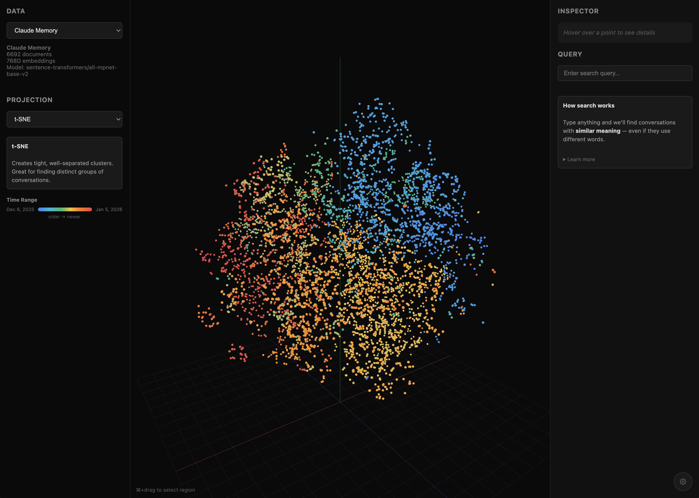

# Claude Memory Visualizer

3D visualization of embedding spaces from [claude-memory](https://github.com/jopnelli/claude-memory) - explore your Claude Code conversations in semantic space.



## Prerequisites

This visualizer works with data from [claude-memory](https://github.com/jopnelli/claude-memory). You'll need:

1. **[Bun](https://bun.sh)** - Fast JavaScript runtime
   ```bash
   curl -fsSL https://bun.sh/install | bash
   ```

2. **claude-memory installed and synced** - Follow the [claude-memory setup guide](https://github.com/jopnelli/claude-memory)

3. **Python dependencies** for the export script (or use claude-memory's venv):
   ```bash
   pip install chromadb umap-learn scikit-learn numpy
   # Or if you have claude-memory installed:
   # ~/dev/claude-memory/.venv/bin/python scripts/export-chromadb.py
   ```

4. **Ollama** (optional) - For AI summaries when box-selecting points:
   ```bash
   ollama pull qwen2.5:1.5b   # or any text model
   ```

## Quick Start

```bash
# Clone the repo
git clone https://github.com/jopnelli/claude-memory-visualizer
cd claude-memory-visualizer

# Install dependencies
bun install

# Export your claude-memory data (skip if just trying the demo)
python scripts/export-chromadb.py

# Start dev server
bun run dev
```

Open http://localhost:5173

The visualizer auto-loads your Claude Memory data if available, otherwise shows a demo dataset.

## Features

- **3D Point Cloud** - Visualize thousands of conversation embeddings in 3D space
- **Pre-computed Projections** - UMAP, t-SNE, PCA computed server-side for instant switching
- **Semantic Search** - Find conversations by meaning using `all-mpnet-base-v2` embeddings
- **Box Selection** - Cmd+drag to select regions, get AI summaries via Ollama
- **Time-based Coloring** - Older conversations in blue, newer in red
- **Inspector Panel** - Hover/click to see full document text and metadata

## Export Script

The Python export script (`scripts/export-chromadb.py`) reads from ChromaDB and pre-computes all three projections:

```bash
# Basic usage (reads from ~/.claude-memory/chroma)
python scripts/export-chromadb.py

# Custom options
python scripts/export-chromadb.py \
  --chroma-path /path/to/chroma \
  --output public/data/my-data.json \
  --limit 1000
```

**Output format:**
```json
{
  "metadata": {
    "name": "Claude Memory",
    "embedding_model": "sentence-transformers/all-mpnet-base-v2",
    "embedding_dim": 768,
    "count": 3486
  },
  "documents": [...],
  "projections": {
    "umap": [[x, y, z], ...],
    "tsne": [[x, y, z], ...],
    "pca": [[x, y, z], ...]
  }
}
```

## Data Sources

1. **Claude Memory** - Your exported claude-memory data with full semantic search
2. **Demo Dataset** - A small sample dataset to explore the interface (text search only)

## Tech Stack

- **Three.js** - 3D rendering with point clouds and OrbitControls
- **DRUIDJS** - Browser-side dimensionality reduction (fallback if no pre-computed projections)
- **Transformers.js** - In-browser `all-mpnet-base-v2` embeddings for semantic search (~420MB, cached)
- **Ollama** - Local AI summaries for box selection (optional)
- **Bun + Vite** - Dev server and bundling
- **TypeScript** - Type-safe codebase

## Algorithms

| Algorithm | Speed | Quality | Best For |
|-----------|-------|---------|----------|
| **UMAP** | Fast | High | Default choice, good balance |
| **t-SNE** | Slow | High | Tight, well-separated clusters |
| **PCA** | Instant | Medium | Quick overview, may have overlap |

## Known Limitations

- **Turn-level chunking**: claude-memory chunks at individual turns (1 user + 1 assistant message), not full conversations. Search may miss context that spans multiple turns.
- **First search delay**: Downloads ~420MB embedding model on first search (cached after)
- **Best for <10k docs**: Larger datasets may be slow to render

## Development

```bash
# Start dev server
bun run dev

# Re-export data after claude-memory changes
python scripts/export-chromadb.py
```

### Faster Semantic Search (Optional)

By default, semantic search downloads a ~420MB embedding model to the browser on first use. For faster search, run the local embedding server:

```bash
# Use claude-memory's venv (already has sentence-transformers)
~/dev/claude-memory/.venv/bin/python scripts/embed-server.py

# Or install separately and run
pip install sentence-transformers
python scripts/embed-server.py
```

The visualizer auto-detects the local server and uses it for faster search.

## License

MIT
